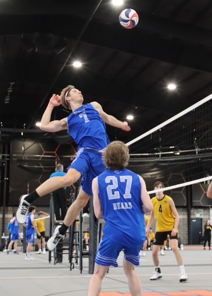

# some folks think

- I am really good at Computers.
  - Reality: I have always been computing, still learning everyday.  Knowing what you don't know is a powerful thing :-)
- I like building things.
  - Reality: I love Lego Ninjago builds, Minecraft and any opportunity to breakdown complex projects into workable items.
- I am easy to find at a volleyball game.
  - Reality: I supply an over abundance of positive energy on the court.
    
# nicknames

  - "The Mitch" - Reference to "The Rock" and his positivity in light of dire odds.
  - "The Berlin Wall" - Reference to my high school (Olentangy Berlin) and record setting number of blocks in volleyball. 
 
# summary

- I love learning about new technologies, creating new software, and exploring new ideas.
- I'm also a big supporter of the intersection of healthcare and technology as well as robotics.
- I love bringing out the best in others in hopes they reach higher levels.
- I love every type of volleyball (sand, grass, mud and indoors).
- I am a foodie, I will try anything and enjoy almost everything.
- Currently, I have experience in conducting research and teaching at OSU, worked at a tech startup, and have built applications for education and personal usage.

