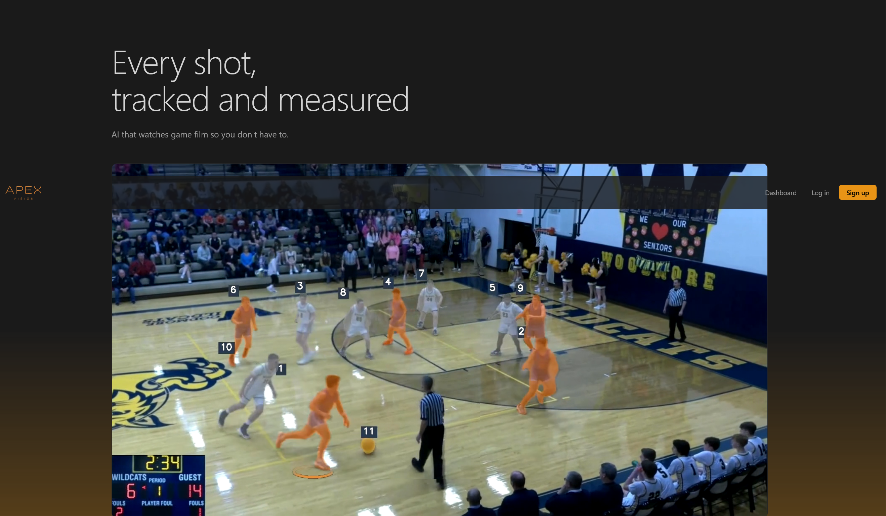
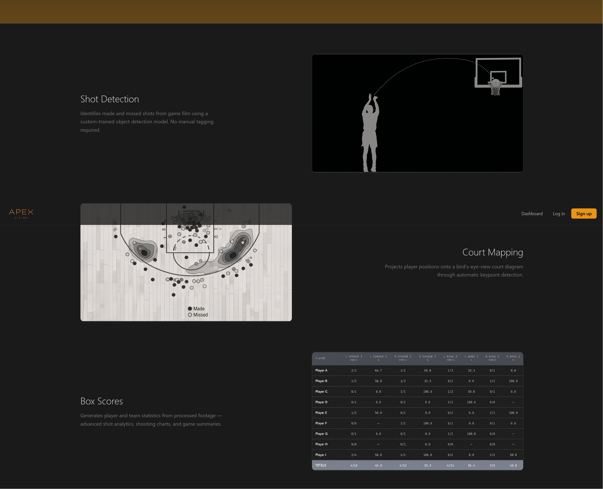

During the Spring of 2026, for our Intro to Startups class, developed an end to end application for tracking basketball stats from video using AI computer vision model.   

  - I was responsible for creating tracking pipelines using RF-DETR, bounding boxes, labels, SAM 2.1 and segmentation masks which produced tracking and analytics from basketball game footage.
  - I utilized arc and velocity calculations as well as confidence intervals to flag any shot that may be questionable in the derived statistics for review.

Skills Utilized: React/Tailwind UI, Tanstack for navigation, FastAPI for core/API layer, PostgreSQL and cloud storage for video files.
  
  
