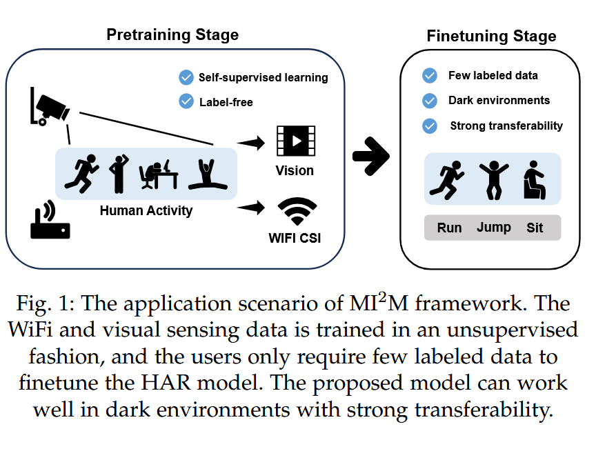

Selected to be a part of this Undergraduate Research Program at OSU to conduct ML research under the Photogrammetric Computer Vision Lab

Skills Utilized: Python, PyTorch, Maskfi, Problem Solving
- Studied maskfi, an emerging technology utilizing a WiFi-based computer vision model to track human gestures without direct video, focusing on equipment placement and QA of diagnostic instruments settings.

 
