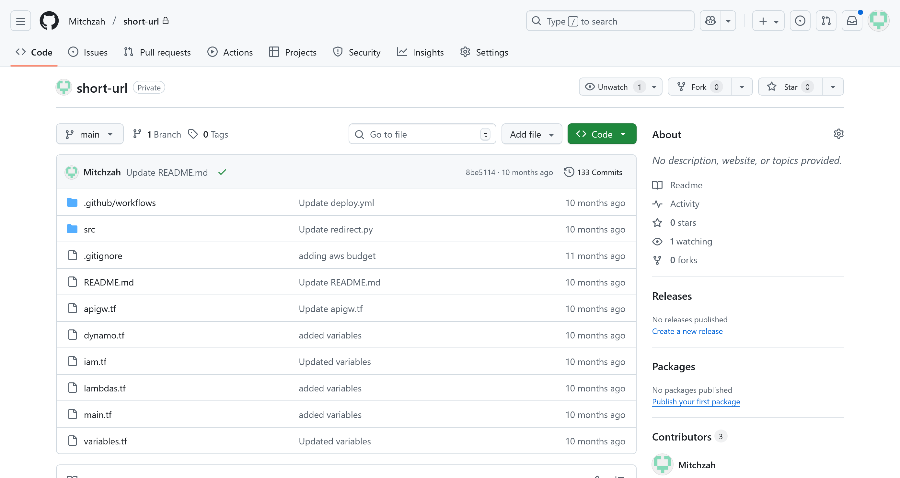

Our local boosters needed a cheap way to create short URLs, like ShortURL or TinyURL, where you input a valid URL address and the application gives you a redirect URL with a small code attached. The boosters then use this in their flyers and on their fund raising websites to make the donor experience easier and to allow for individualized tracking for each booster family.

It was a fun project and has been used many times in past year.

Skills Utilized: Python, AWS, API Gateway, Lambda, GitHub Actions, Terraform, CI/CD, Devops 

- Configured an AWS API Gateway (api.mitch-zahner.com) to expose REST API endpoints that triggered two Python programs to run in AWS Lambdas.
- Automated deployment to AWS cloud infrastructure upon commit via GitHub Actions and Terraform.

 
