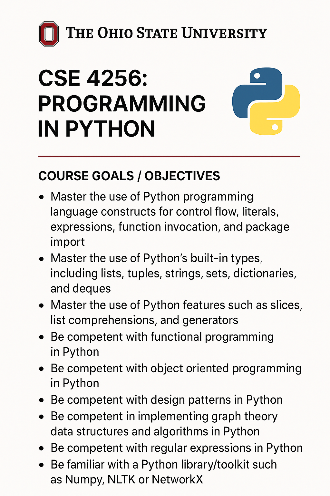

Starting in the fall semester of 2025, I have had the priviledge of working with the Computer Science and Engineering Department in delivering Programming in Python CSE-4256.  

Skills Utilized: Python, GitHub, Teaching, Problem Solving, Software Development
- Delivered instructional support to 58 students in Programming Python, fostering problem-solving skills and enhancing understanding of software development principles.
- Provided lab support, graded 100’s of assignments, and supplied feedback demonstrating strong interpersonal skills and active listening.
  
