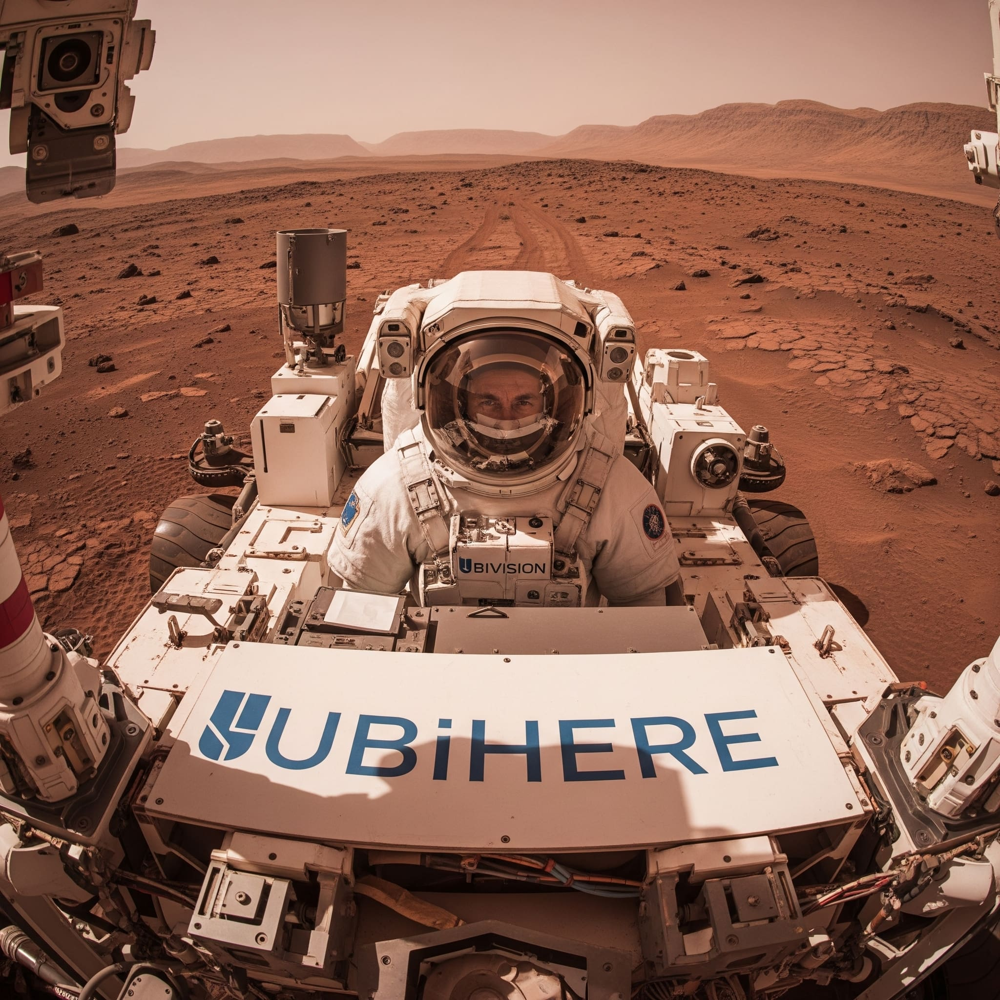

I had the honor of working with several awesome researchers at this startup throughout the summer of 2025.  We had some baseline daily operational tasks to conquer, and then we also had multple opportunities to "go shopping" for electronics that we integrated into small proof of concepts.  One particular POC was to create a video device to monitor ice inventory using small cameras to be able to notify for replensihment and to ensure proper accounting on inventory.

I had a wonderful experience in which I waas able to get hands on with today's cutting edge computer vision technology and at the same time, see firsthand how it was being marketed and its impact on customers.

Skills Utilized: Python, Docker, ETL, AWS, DynamoDB, Scripting, SQL, Problem Solving

- Developed software in Python code for a Docker video processor, ensuring 100% processing of real-time video streams and reducing redundant downstream training cycles by 25%.

- Collaborated with Software Quality Assurance, tested software, and did performance tuning on a Python/DynamoDB indexing system to enable rapid extraction of video segments, reducing query times by 20%.

  [Ubihere](https://www.ubihere.com)
  
  

